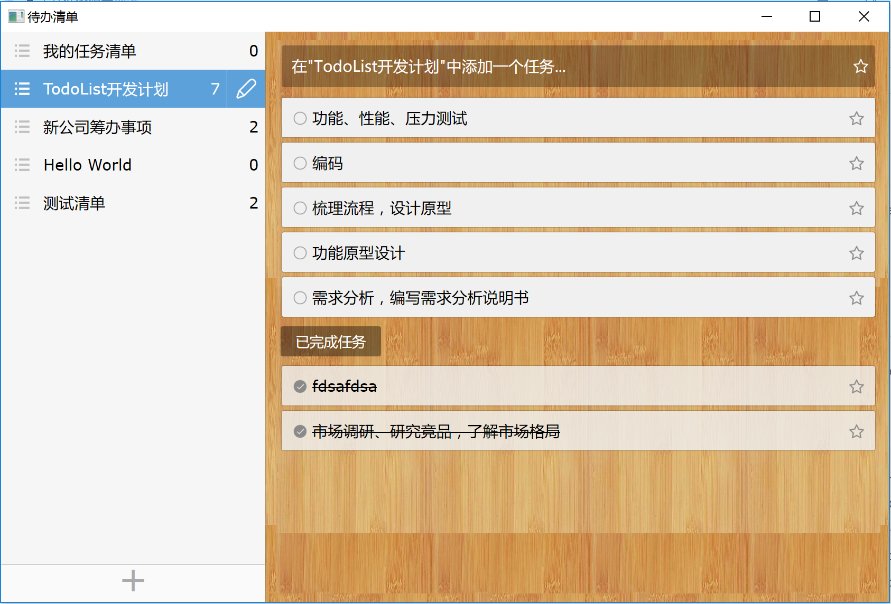

# 一个仿奇妙清单(WunderList)的Demo

## 概述

奇妙清单是我常用的一个TODO list软件，近期学习使用sciter的过程中就想做个小demo练练手，试试sciter脚本的各方面功能。sciter是一个非常不错的html/css3/javascript引擎，可以非常方便地用于开发windows/linux/osx的客户端工具，体积很小，动态库不到4M，便于发布。目前sciter文档很少，公布此demo是为了跟我一样刚入门的新手方便学习借鉴。

目前才刚刚开始，利用一晚上时间做好了界面原型，数据交互和更多的功能看后面时间而定。

构建工具使用了基于lua的xmake -- (https://github.com/tboox/xmake)。

## 截图

## 准备支持的功能

* 存储和管理自己的待办事项
* 提供到期提醒功能
* 支持主题切换

## 将用到的sciter特性

* Native behavior
* vlist
* plus
* drag-drop
* css animation
